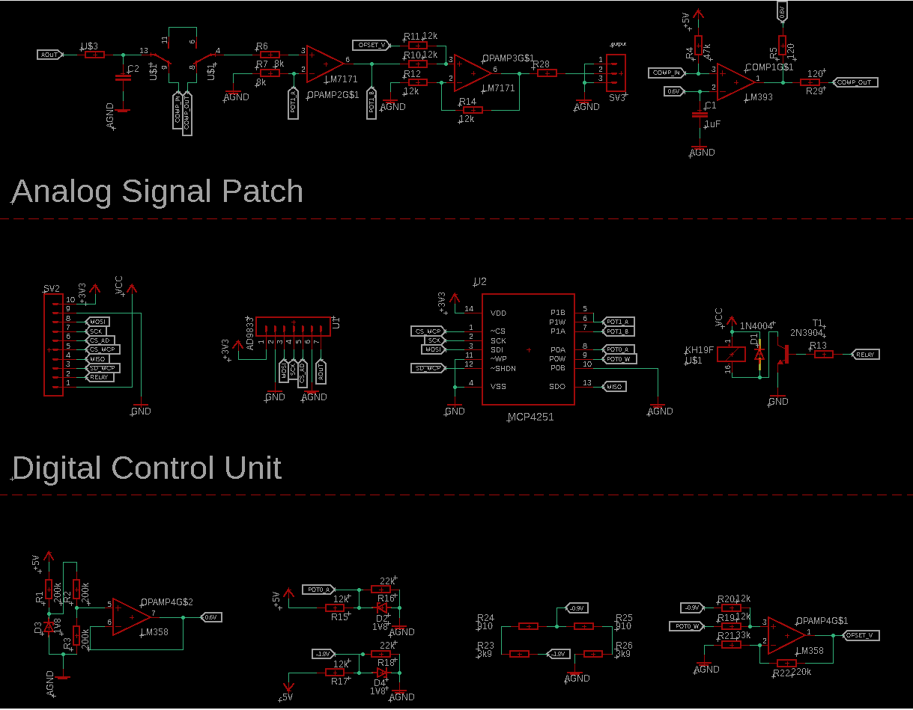

# Waveform_generator_pi_pico

  
  
  
  

## Experimental: project in active development
Do not use 
## Basic Information
Projest aims to build simple waveform generator (with digitaly adjustable amplitude and offset of signal) based around AD9833 DDS chip controled via PC app. With digital and comunication part of the circutry beeing handled by RP2040 on Pi Pico board. 

## Hardware
hardware part of this projest consst of two main elements:
### Analog
Responsible for generating (AD9833) and ampifaing and offsetting (pair of LM7171) analog signal. As well as aditional components needed for example for square wave processing. (attached baord layout require redesign for proper operation of offset capability - work in progress)

### Digital
Responsible for controling analog part of circutry using digital potenciometers (MCP4231 / MC4251) integrated on analog board prototype as well as comunication with PC using galvanicly isoleded interfece.
## PC Software
Coming soon
